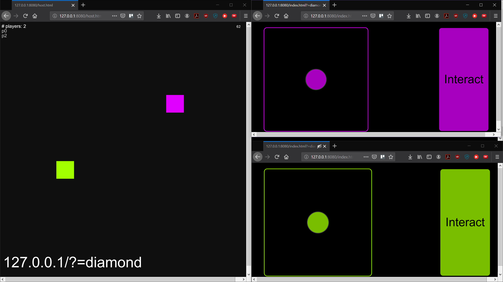

# Sockets_p5js

This contains a set of template files for building a multi-player interactive system where multiple clients can connect to a host page by way of a *node.js* server. The clients and hosts are built using *[p5.js](https://p5js.org)*, and *[socket.io](https://socket.io/)* is used to facilitate communication between them.

## Getting Started

1. Install this GitHub repo on your local machine.

2. If you don't already have *node.js* installed on your machine, go [here](https://nodejs.org/en/download/) and download the version appropriate for your operating system.

3. Open a terminal window and navigate to the project directory.

4. Run the command `npm install`.

5. Next, run the command `node server.js` to start a *node.js* server.

6. Open a second terminal window and navigate to the `public` folder within the project directory.

7. Run `http-server -c-1` to start server. This will default to port *8080*.

8. Open a browser and go to `http://127.0.0.1:8080/host.html`. This will open up a host page. Make note of the URL displayed in the bottom left corner of the screen.

9. Open a second browser and go to the URL displayed on your host page. It will look something like `http://127.0.0.1:8080/index.html?=roomId`, where `roomId` is a randomly generated name. This screen will load a controller that let's you control the movement of a colored square on the host page.

10. You can specify your own room ID by opening a host page using `http://127.0.0.1:8080/host.html?=roomId`, where `roomId` is a string of your choice.
